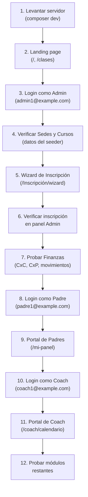

# 🚀 Guía de Pruebas Manuales — Little Brands Inc

## Resumen del Proyecto

**Little Brands Inc** es un sistema de gestión para una academia/escuela que maneja:
- **Inscripciones** de estudiantes con pagos via Stripe
- **Programas y Cursos** con horarios de clases
- **Finanzas** (cuentas por cobrar, por pagar, movimientos)
- **Portal de Padres** (ver Inscripciones, reportar pagos)
- **Portal de Coach** (calendario, asistencia)
- **Landing page pública** con formulario de contacto

---

## Paso 1: Prerequisitos

Asegúrate de tener instalado:

| Herramienta | Versión requerida |
|---|---|
| PHP | >= 8.2 |
| Composer | Última versión |
| Node.js / NPM | >= 18 |
| MySQL | 5.7+ o 8.x |

---

## Paso 2: Setup Inicial

### 2.1 Crear la base de datos MySQL

```sql
CREATE DATABASE littlebrandsinc CHARACTER SET utf8mb4 COLLATE utf8mb4_unicode_ci;
```

> [!NOTE]
> El `.env` ya está configurado con `DB_DATABASE=littlebrandsinc`, `DB_USERNAME=root`, `DB_PASSWORD=` (sin contraseña). Ajusta si tu MySQL tiene credenciales diferentes.

### 2.2 Instalar dependencias

```bash
# En la raíz del proyecto:
composer install
npm install
```

### 2.3 Ejecutar migraciones y seeders

```bash
php artisan migrate --seed
```

Esto creará todas las tablas y poblará datos de prueba (usuarios, sedes, programas, cursos, cuentas financieras, movimientos).

### 2.4 Levantar el servidor de desarrollo

El proyecto tiene un script `composer dev` que levanta todo de golpe:

```bash
composer dev
```

Esto ejecuta en paralelo:
- 🌐 **Laravel server** → `http://localhost:8000`
- 📮 **Queue worker** (procesa jobs)
- 📋 **Pail** (logs en tiempo real)
- ⚡ **Vite** (compilación de assets en caliente)

> [!IMPORTANT]
> Si `composer dev` no funciona, puedes levantar cada servicio manualmente en terminales separadas:
> ```bash
> php artisan serve                         # Terminal 1
> php artisan queue:listen --tries=1        # Terminal 2
> npm run dev                               # Terminal 3
> ```

---

## Paso 3: Credenciales de Prueba

### Usuarios seedeados

| Rol | Email | Contraseña | Notas |
|---|---|---|---|
| **Administrador** | `admin1@example.com` | `password` | Acceso total al sistema |
| **Administrador** | `hectorgabrieldm@hotmail.com` | `alinware98_` | Tu cuenta personal |
| **Coach** | `coach1@example.com` | `password` | Portal de Coach |
| **Padre** | `padre1@example.com` | `password` | Portal de Padres |

> [!TIP]
> Hay 10 usuarios de cada rol (`admin1` a `admin10`, `coach1` a `coach10`, `padre1` a `padre10`), todos con contraseña `password`.

---

## Paso 4: Checklist de Pruebas Manuales

### 🌐 Landing Page (Pública — sin login)

| # | Prueba | URL | Qué verificar |
|---|---|---|---|
| 1 | Página principal | `/` | Se carga la landing page, diseño visual correcto |
| 2 | Listado de clases | `/clases` | Muestra los cursos disponibles |
| 3 | Formulario de contacto | `/contacto` (POST desde landing) | Enviar mensaje, verificar que se guarda |
| 4 | Términos y condiciones | `/terms` | Se muestra la página estática |
| 5 | Política de privacidad | `/privacy` | Se muestra la página estática |

---

### 📝 Wizard de Inscripción (Pública — sin login)

| # | Prueba | URL | Qué verificar |
|---|---|---|---|
| 6 | Acceder al wizard | `/Inscripción/wizard` | Carga el formulario multi-paso |
| 7 | Completar paso a paso | — | Seleccionar programa, llenar datos del estudiante y representante |
| 8 | Pago con Stripe (test) | — | Usar tarjeta de prueba `4242 4242 4242 4242` |
| 9 | Resetear wizard | `/Inscripción/wizard/reset` | Limpia la sesión del wizard |

> [!NOTE]
> Para probar Stripe, usa las [tarjetas de prueba](https://docs.stripe.com/testing): `4242 4242 4242 4242`, fecha futura, CVC cualquier 3 dígitos.

---

### 🏠 Dashboard Admin (Login como `admin1@example.com`)

| # | Prueba | URL | Qué verificar |
|---|---|---|---|
| 10 | Dashboard | `/home` | Estadísticas y resumen general |
| 11 | Lista de estudiantes | `/students` | CRUD de estudiantes, búsqueda |
| 12 | Detalle de estudiante | `/students/{id}` | Información completa, Inscripciones |
| 13 | Importar estudiantes | `/students/import` | Subir Excel (`.xlsx`) |
| 14 | Lista de padres | `/parents` | Listado de usuarios rol Padre |
| 15 | Lista de entrenadores | `/trainers` | Listado de usuarios rol Coach |

---

### 📚 Programas y Cursos (Admin)

| # | Prueba | URL | Qué verificar |
|---|---|---|---|
| 16 | Listado de cursos | `/courses` | Se muestran los cursos seedeados |
| 17 | Crear curso | `/courses/create` | Formulario, selección de programa y coach |
| 18 | Editar curso | `/courses/{id}/edit` | Modificar datos del curso |
| 19 | Eliminar curso | — | Botón de eliminar funciona |
| 20 | Gestión de clases | — | Crear/editar/eliminar clases (horarios) |

---

### 🏢 Sedes (Admin)

| # | Prueba | URL | Qué verificar |
|---|---|---|---|
| 21 | Listado de sedes | `/branches` | Se muestran las sedes seedeadas |
| 22 | Crear sede | `/branches/create` | Formulario funcional |
| 23 | Editar sede | `/branches/{id}/edit` | Modificación correcta |
| 24 | Eliminar sede | — | Eliminación correcta |

---

### 📅 Calendario (Admin)

| # | Prueba | URL | Qué verificar |
|---|---|---|---|
| 25 | Vista de calendario | `/calendar` | Se renderizan los eventos |
| 26 | Eventos JSON | `/calendar/events` | API devuelve datos correctos |

---

### 📋 Inscripciones (Admin)

| # | Prueba | URL | Qué verificar |
|---|---|---|---|
| 27 | Listado de Inscripciones | `/enrollment` | Tabla con filtros |
| 28 | Detalle de inscripción | `/enrollment/{id}` | Información completa |
| 29 | Cambiar estado | — | Aprobar/rechazar inscripción |
| 30 | Actualización masiva | — | Bulk update de estados |
| 31 | Descargar recibo | `/enrollment/{id}/receipt` | Genera PDF (dompdf) |

---

### 💰 Finanzas (Admin)

| # | Prueba | URL | Qué verificar |
|---|---|---|---|
| 32 | Dashboard financiero | `/finanzas-y-facturacion` | Resumen de finanzas |
| 33 | Cobranzas (CxC) | `/finanzas-y-facturacion/cobranzas` | Listado de cuentas por cobrar |
| 34 | Crear cobranza | — | Formulario de nueva CxC |
| 35 | Registrar abono a CxC | — | Pago parcial/total |
| 36 | Cuentas por pagar | `/finanzas-y-facturacion/cuentas-por-pagar` | Listado de CxP |
| 37 | Crear CxP | — | Formulario de nueva CxP |
| 38 | Registrar abono a CxP | — | Pago parcial/total |
| 39 | Movimientos (transacciones) | — | Crear movimiento financiero |
| 40 | Descargar comprobante | — | PDF de comprobante |
| 41 | Pagos de padres | `/finanzas-y-facturacion/pagos-padres` | Listado, aprobar/rechazar |
| 42 | Cuentas contables | `/accounts` | CRUD de cuentas |

---

### 📬 Mensajes de Contacto (Admin)

| # | Prueba | URL | Qué verificar |
|---|---|---|---|
| 43 | Listado de mensajes | `/mensajes` | Mensajes recibidos del landing |
| 44 | Marcar como leído | — | Cambia estado del mensaje |
| 45 | Marcar como no leído | — | Revierte estado |

---

### ⏳ Lista de Espera (Admin)

| # | Prueba | URL | Qué verificar |
|---|---|---|---|
| 46 | Listado de espera | `/lista-de-espera` | Estudiantes en espera |
| 47 | Aprobar entrada | — | Mueve de espera a inscrito |
| 48 | Rechazar entrada | — | Rechaza la solicitud |

---

### 👤 Gestión de Usuarios (Admin)

| # | Prueba | URL | Qué verificar |
|---|---|---|---|
| 49 | Listado de usuarios | `/users` | Todos los usuarios del sistema |
| 50 | Crear usuario | — | Formulario de registro |
| 51 | Editar usuario | `/users/{id}/edit` | Modificar rol, datos |
| 52 | Eliminar usuario | — | Eliminación correcta |
| 53 | Perfil propio | `/profile` | Ver/editar perfil |

---

### 👨‍👧 Portal de Padres (Login como `padre1@example.com`)

| # | Prueba | URL | Qué verificar |
|---|---|---|---|
| 54 | Mi panel | `/mi-panel` | Ve sus hijos inscritos, cuotas |
| 55 | Registrar pago | — | Sube comprobante de pago |

> [!WARNING]
> Para que el Portal de Padres tenga datos, primero inscribe un estudiante vinculado a `padre1@example.com` usando el wizard o desde el admin.

---

### 🏋️ Portal de Coach (Login como `coach1@example.com`)

| # | Prueba | URL | Qué verificar |
|---|---|---|---|
| 56 | Calendario del Coach | `/coach/calendario` | Ve sus clases asignadas |
| 57 | Eventos del Coach | `/coach/calendario/events` | API devuelve eventos correctos |
| 58 | Marcar asistencia | — | Registra asistencia de alumnos en una clase |

> [!WARNING]
> Para que el Coach vea clases, debe tener cursos asignados. Asegúrate desde el admin de asignar cursos al coach.

---

## Orden Recomendado de Pruebas



---

## Posibles Problemas

| Problema | Solución |
|---|---|
| Error de conexión a MySQL | Verifica `DB_*` en `.env`, asegura que MySQL esté corriendo |
| `npm run dev` falla | Ejecuta `npm install` primero |
| Stripe da error | Verifica que `STRIPE_KEY` y `STRIPE_SECRET` estén correctos en `.env` |
| `Class not found` | Ejecuta `composer dump-autoload` |
| Migraciones fallan | Asegura que la BD `littlebrandsinc` existe y está vacía |
| Cola no procesa jobs | Verifica que `php artisan queue:listen` esté corriendo |
